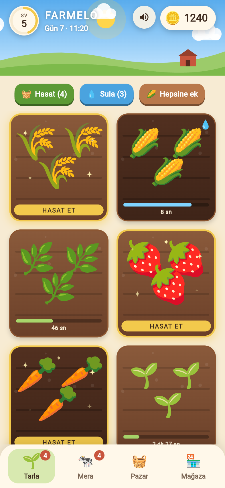
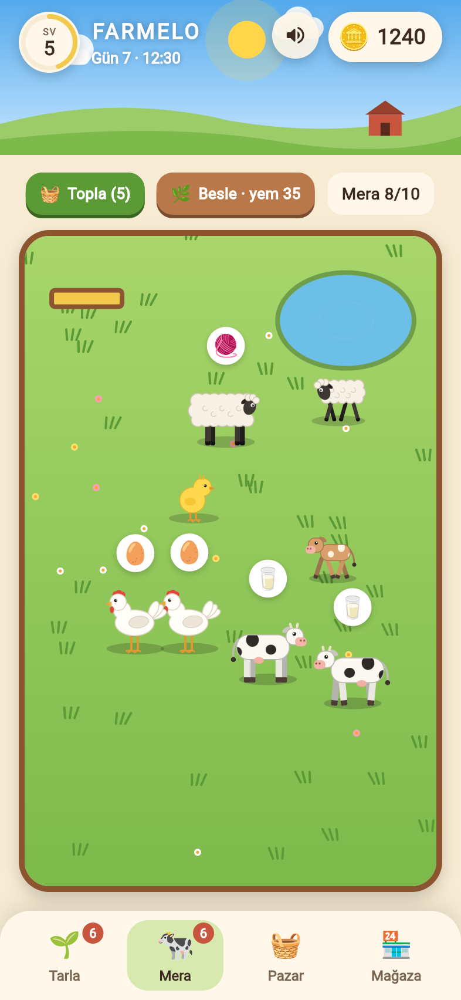
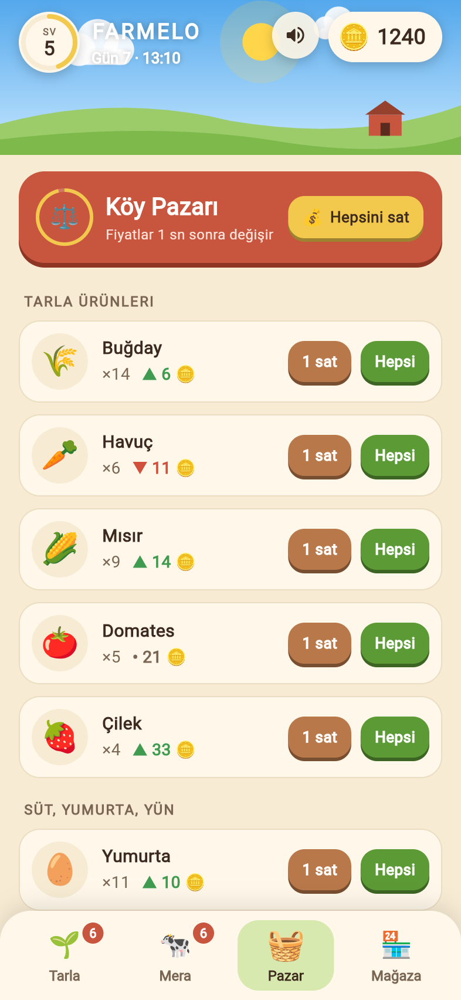
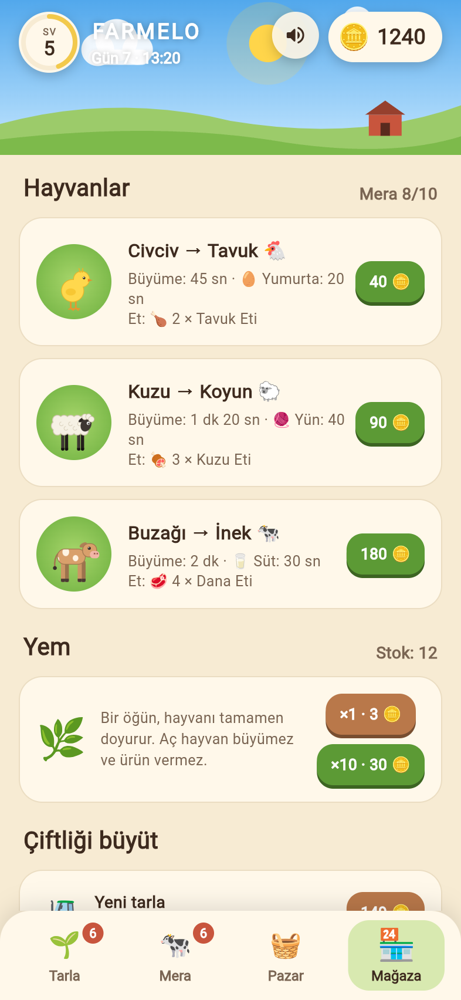
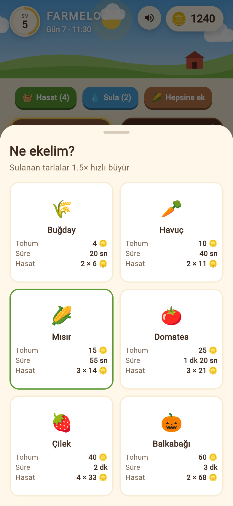
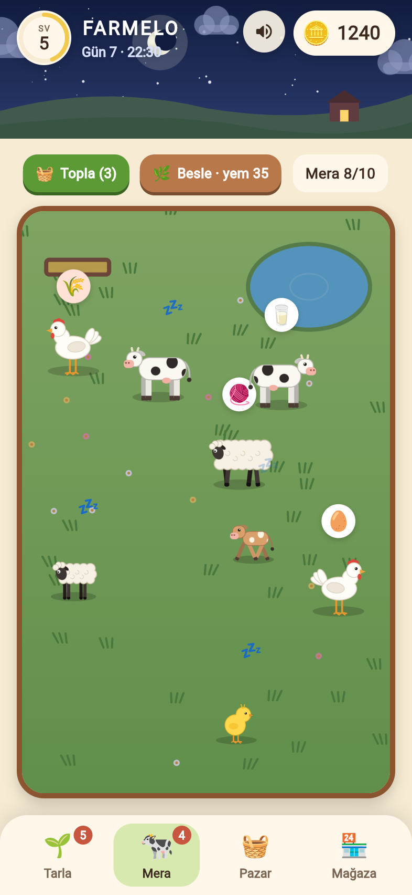

# Farmelo 🌾

Farmelo, Flutter ile yazılmış animasyonlu bir çiftlik oyunudur. Tarlaya tohum ekip hasat edersin. Yavru hayvanları besleyip büyütürsün. Yetişen hayvanlardan süt, yumurta ve yün toplarsın ya da onları et olarak satarsın. Ürünlerini köy pazarında, fiyatı iyiyken satarsın.

## Ekran görüntüleri

| Tarla | Mera | Pazar | Mağaza |
| :---: | :---: | :---: | :---: |
|  |  |  |  |

| Tohum seçimi | Gece |
| :---: | :---: |
|  |  |

## Oynanış

| Sekme | Ne yapılır |
| --- | --- |
| 🌱 **Tarla** | Boş tarlaya dokun, tohum seç. Büyüyen tarlaya dokunursan sulanır ve 1,5 kat hızlı büyür. Olgunlaşan ürüne dokunup hasat et. |
| 🐄 **Mera** | Hayvanlar merada kendi başına dolaşır. Dokunmak ürünü toplar ya da aç hayvanı besler. Uzun basınca detay paneli açılır. Yetişkin hayvanı buradan et olarak satabilirsin. |
| 🧺 **Pazar** | Ambardaki ürünleri satarsın. Fiyatlar 30 saniyede bir değişir; ▲ yükseldi, ▼ düştü demektir. |
| 🏪 **Mağaza** | Yavru hayvan, yem, yeni tarla ve mera genişletmesi satın alırsın. |

- Aç kalan hayvan büyümez ve ürün vermez, başının üstünde 🌾 baloncuğu çıkar. Bir öğün yem hayvanı tamamen doyurur. Yem bitince buğday ve mısır da yem olarak kullanılır.
- Hasat etmek ve ürün toplamak deneyim kazandırır. Seviye atladıkça yeni bitkiler ve hayvanlar açılır.
- Gökyüzünde gün-gece döngüsü vardır. Bir gün 4 dakika sürer. Gece hayvanlar uyur 💤.
- İlerleme her 5 saniyede bir otomatik kaydedilir. Oyun kapalıyken geçen süre de sayılır (en fazla 3 saat): ürünler büyür, hayvanlar acıkır.

### Bitkiler

| Bitki | Açılır | Tohum | Süre | Hasat | Taban fiyat |
| --- | --- | --- | --- | --- | --- |
| 🌾 Buğday | Seviye 1 | 4 🪙 | 20 sn | 2 | 5 🪙 |
| 🥕 Havuç | Seviye 1 | 10 🪙 | 40 sn | 2 | 12 🪙 |
| 🌽 Mısır | Seviye 2 | 15 🪙 | 55 sn | 3 | 12 🪙 |
| 🍅 Domates | Seviye 3 | 25 🪙 | 80 sn | 3 | 20 🪙 |
| 🍓 Çilek | Seviye 4 | 40 🪙 | 2 dk | 4 | 25 🪙 |
| 🎃 Balkabağı | Seviye 5 | 60 🪙 | 3 dk | 2 | 80 🪙 |

### Hayvanlar

| Hayvan | Açılır | Fiyat | Büyüme | Ürün | Et olarak |
| --- | --- | --- | --- | --- | --- |
| Civciv → Tavuk | Seviye 1 | 40 🪙 | 45 sn | 🥚 Yumurta, 20 sn'de bir | 🍗 2 × Tavuk eti |
| Kuzu → Koyun | Seviye 2 | 90 🪙 | 80 sn | 🧶 Yün, 40 sn'de bir | 🍖 3 × Kuzu eti |
| Buzağı → İnek | Seviye 3 | 180 🪙 | 2 dk | 🥛 Süt, 30 sn'de bir | 🥩 4 × Dana eti |

Tüm değerler [lib/game/data.dart](lib/game/data.dart) dosyasında durur. Oyunun dengesini buradan ayarlayabilirsin.

## Çalıştırma

Gereken: Dart 3.13 veya üstünü içeren bir Flutter sürümü. Oyun Flutter 3.47 ile geliştirildi.

```bash
flutter pub get
flutter run -d macos     # ya da: -d chrome, bir iOS/Android cihaz
```

Testler:

```bash
flutter test
```

Testler oyun mantığını (ekim, sulama, besleme, et satışı, pazar), seviye atlama kutlamasının kapanmasını ve tüm sayfaların telefon ve masaüstü boyutunda taşmadan açıldığını denetler.

## Sesler

Hayvan sesleri (böğürme, meleme, gıdaklama ve yavru sesleri) ile efektler (hasat, ekim, sulama, para, satın alma, seviye atlama) [assets/sounds/](assets/sounds/) altındadır. Hazır kayıt kullanılmadı; hepsi [tool/generate_sounds.py](tool/generate_sounds.py) ile sentezlendi. Bu betik ek kütüphane gerektirmez. Bir sesi değiştirmek için betiği düzenleyip yeniden çalıştır:

```bash
python3 tool/generate_sounds.py
```

- Sesi üst çubuktaki 🔊 düğmesiyle açıp kapatabilirsin. Tercih kaydedilir.
- Sesler çalan müziği kesmez, onunla karışır. iOS'ta sessiz moda uyulur.
- Merada ara sıra bir hayvan kendiliğinden ses çıkarır.

## Proje yapısı

```
lib/
  main.dart                 Açılış: kayıt, ses ve oyun döngüsünü başlatır
  game/
    data.dart               Bitki, hayvan ve ürün tanımları (denge ayarları)
    game_state.dart         Oyun mantığı, zaman döngüsü, kayıt/yükleme
  audio/
    sfx.dart                Ses efektleri ve ses açma/kapama
  ui/
    home_screen.dart        Sayfa geçişleri, alt menü, bildirimler, seviye kutlaması
    field_page.dart         Tarla ve tohum seçimi
    pasture_page.dart       Mera, dolaşan hayvanlar, hayvan detay paneli
    market_page.dart        Pazar
    shop_page.dart          Mağaza ve "Nasıl oynanır?"
    theme.dart              Renkler ve tema
    widgets/
      animal_figure.dart    Bacaklı, yürüyen hayvan çizimleri (CustomPainter)
      sky_header.dart       Gün-gece döngülü gökyüzü ve göstergeler
      fx.dart               Uçan para/ürün ve süzülen yazı efektleri
      common.dart           Ortak düğme, ilerleme çubuğu ve animasyon yardımcıları
assets/sounds/              Ses dosyaları (WAV)
tool/generate_sounds.py     Ses üretici
test/                       Mantık ve arayüz testleri
```

### Nasıl çalışır

- **Oyun döngüsü:** `GameState` saniyede 10 kez ilerler. Bitkiler büyür, hayvanlar acıkır ve ürün üretir, pazar fiyatları değişir. Değişiklikler `GameScope` (bir `InheritedNotifier`) üzerinden arayüze yansır.
- **Hayvan çizimleri:** Emoji yerine `AnimalPainter` ile çizilir. Dört ayaklılar çapraz bacaklarla tırıs gider. Tavuklar iki ayak üstünde yürür ve başlarını ileri geri sallar. Hayvan durunca bacaklar yumuşakça toparlanır ve hayvan yavaşça nefes alır.
- **Animasyonlar:** Hasat edilen ürünler Pazar sekmesine, kazanılan paralar üstteki sayaca uçar. Bunlar kök `Overlay` üzerinde çizilen efektlerdir ([fx.dart](lib/ui/widgets/fx.dart)).
- **Kayıt:** Oyun durumu JSON olarak `shared_preferences` içinde tutulur. Mağaza sayfasının en altındaki "Oyunu sıfırla" düğmesi her şeyi sıfırlar.

## Kullanılan paketler

- [`shared_preferences`](https://pub.dev/packages/shared_preferences): ilerlemeyi kaydeder.
- [`audioplayers`](https://pub.dev/packages/audioplayers): ses efektlerini çalar.
